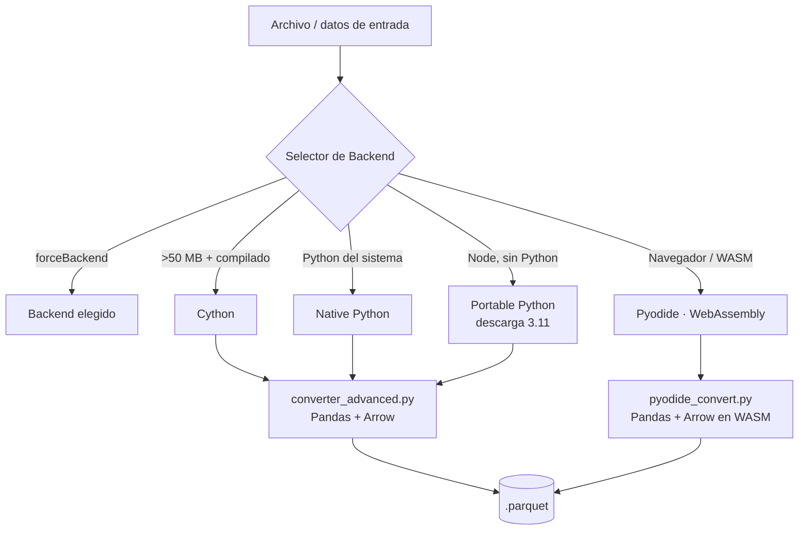

<div align="center">

# 🚀 Ultra Parquet Converter

### Conversor híbrido profesional **CSV / JSON / Excel → Parquet** para Node.js y el navegador

Velocidad nativa cuando hay Python, **WebAssembly sin instalar nada** cuando no lo hay.

[](https://www.npmjs.com/package/ultra-parquet-converter)
[](https://www.npmjs.com/package/ultra-parquet-converter)
[](https://opensource.org/licenses/Apache-2.0)
[](https://nodejs.org)
[](https://www.typescriptlang.org)
[](https://webassembly.org)

**[English](README.md)** · **[Español](README.es.md)** · **[Changelog](CHANGELOG.md)** · **[Arquitectura](docs/ARCHITECTURE.md)**

</div>

---

Ultra Parquet Converter combina la orquestación de **Node.js** con la potencia de datos de **Python + Apache Arrow** para convertir más de 19 formatos tabulares en **Parquet** compacto y listo para analítica — con streaming para archivos enormes, reparación automática de datos corruptos y **cuatro backends intercambiables** que no requieren configuración.

```bash
npm install -g ultra-parquet-converter
ultra-parquet-converter convert ventas.csv       # → ventas.parquet, backend automático
```

---

## 🆕 Novedades en 1.4.0

> Release de robustez y limpieza. Lo principal:

- 🌐 **Camino WebAssembly arreglado de punta a punta.** El backend Pyodide ahora funciona correctamente a través del selector automático: `convert(ruta)` lee el archivo, convierte en WASM y **escribe el `.parquet` a disco**.
- 🧠 **Nueva API en memoria** `PyodideBackend.convertData(datos)` para el navegador y uso programático (devuelve los bytes Parquet, sin filesystem).
- 🔓 **`--backend pyodide` ya no exige Python del sistema** — conversiones reales sin instalar nada desde el CLI.
- ♻️ **Fuente única** para el código de conversión WASM (`python/pyodide_convert.py`), compartida por Node y el worker del navegador — sin Python duplicado.

Mira el [CHANGELOG](CHANGELOG.md) completo.

---

## ✨ Características

| | |
|---|---|
| 🔍 **Auto‑detección inteligente** | Detecta el formato por extensión **y** por contenido (magic bytes) |
| ⚡ **Ultra‑rápido** | Apache Arrow + Pandas optimizado por debajo |
| 🌊 **Streaming** | Convierte archivos de 1 GB, 5 GB, 20 GB+ sin reventar la memoria |
| 🔧 **Auto‑reparación** | Arregla CSVs rotos, elimina columnas vacías, quita duplicados |
| 📊 **Auto‑normalización** | Limpia nombres de columnas, infiere tipos automáticamente |
| 🧠 **Compresión adaptativa** | Elige snappy / zstd / lz4 / gzip / brotli por ti |
| 🏗️ **4 backends** | Native · Portable · WebAssembly · Cython — auto‑seleccionados |
| 🌐 **Corre en el navegador** | Camino WebAssembly completo, sin Python |
| 🎨 **CLI pulido** | Colores, spinners, barras de progreso, modos batch y watch |
| 🧩 **API tipada** | Tipos TypeScript de primera para cada opción y resultado |

---

## 🏗️ Arquitectura



**Prioridad de auto‑selección:** Cython (archivos grandes) → Native Python → Portable Python → Pyodide.

| Backend | Velocidad | Requiere | Ideal para |
|---------|:---------:|----------|------------|
| **Cython** | 🚀🚀🚀🚀🚀 | Python 3.11 + módulos compilados | Archivos grandes (> 50 MB) |
| **Native Python** | ⚡⚡⚡⚡⚡ | Python 3.11 | Uso general |
| **Portable Python** | ⚡⚡⚡⚡ | Solo Node.js (descarga Python) | Sin Python instalado |
| **Pyodide** | ⚡⚡ | Nada (WebAssembly) | Navegador / sin instalar |

> **¿Sin Python?** No hay problema. **Portable Python** descarga Python 3.11 en el primer uso (~30 MB en Windows, ~50 MB en Linux/macOS). **Pyodide** corre enteramente en WebAssembly — incluso en el navegador.

---

## 📋 Formatos soportados (19+)

| Categoría | Formatos | Native / Portable / Cython | Pyodide (WASM) |
|-----------|----------|:--------------------------:|:--------------:|
| **Delimitados** | CSV, TSV, PSV, DSV (`.csv` `.tsv` `.psv` `.dsv` `.txt` `.log`) | ✅ | ✅ |
| **Hojas de cálculo** | Excel (`.xlsx` `.xls`) | ✅ | ✅ |
| **Estructurados** | JSON, NDJSON/JSONL (`.json` `.ndjson` `.jsonl`) | ✅ | ✅ |
| | XML, YAML, HTML (`.xml` `.yaml` `.yml` `.html`) | ✅ | — |
| **Big data** | Feather/Arrow, ORC, Avro (`.feather` `.arrow` `.orc` `.avro`) | ✅ | Parquet/Feather |
| **Bases de datos** | SQLite (`.sqlite` `.db`) | ✅ | — |
| **Estadísticos** | SPSS, SAS, Stata (`.sav` `.sas7bdat` `.dta`) | ✅ | — |

> El backend WebAssembly cubre los formatos más comunes (CSV/TSV/PSV/JSON + Excel/Parquet). Para la matriz completa, usa un backend con Python.

---

## 🔧 Instalación

**Requisitos:** Node.js ≥ 18. Python 3.11 se recomienda para los backends Native/Cython (opcional — Portable y Pyodide no necesitan Python).

```bash
# Global (recomendado para el CLI)
npm install -g ultra-parquet-converter

# O como dependencia del proyecto
npm install ultra-parquet-converter
```

<details>
<summary><b>Opcional: instalar dependencias de Python 3.11 (para backends Native/Cython)</b></summary>

```bash
pip install pandas pyarrow numpy openpyxl lxml pyyaml fastavro pyreadstat
```

Para entornos offline / sin internet, instala wheels precompilados filtrados por `cp311` y tu SO (`win_amd64`, `linux_x86_64`, `macosx`):

```bash
pip install --no-index --find-links=./wheels \
  pandas pyarrow numpy openpyxl lxml pyyaml fastavro pyreadstat
```

¿No tienes Python? Sáltate esto — `--backend portable-python` o `--backend pyodide` funcionan sin él.

</details>

---

## 🚀 Inicio rápido

### CLI

```bash
# Conversión simple (backend automático)
ultra-parquet-converter convert datos.csv

# Con opciones
ultra-parquet-converter convert datos.json -o salida.parquet --streaming -v

# Sin instalar nada, vía WebAssembly (no necesita Python del sistema)
ultra-parquet-converter convert datos.csv --backend pyodide

# Convertir muchos archivos
ultra-parquet-converter batch "*.csv" -o convertidos/

ultra-parquet-converter --help
```

### API Node.js / TypeScript

```typescript
import { convertToParquet } from 'ultra-parquet-converter';

// Selección automática de backend
const result = await convertToParquet('datos.csv');
console.log(`${result.rows} filas → ${result.compression_ratio}% de compresión`);
console.log(`Backend: ${result.backend}`);

// Opciones completas
await convertToParquet('archivo_enorme.csv', {
  output: 'salida.parquet',
  compression: 'zstd',          // snappy | zstd | lz4 | gzip | brotli | none | adaptive
  streaming: true,
  autoRepair: true,
  autoNormalize: true,
  parallelWorkers: 4,
  verbose: true,
  forceBackend: 'cython',       // fuerza un backend específico
});
```

### Navegador (WebAssembly, sin Python)

```typescript
import { PyodideBackend } from 'ultra-parquet-converter';

const backend = new PyodideBackend();

// Desde un <textarea>, fetch() o un File
const csv = 'id,nombre,ciudad\n1,Juan,Lima\n2,Maria,Cusco';
const result = await backend.convertData(csv);

// result.parquet_bytes → number[]; conviértelo en un Blob descargable
const blob = new Blob([new Uint8Array(result.parquet_bytes!)], {
  type: 'application/octet-stream',
});

// La entrada binaria (Excel / Parquet) también funciona, vía ArrayBuffer:
const file = document.querySelector('input[type=file]')!.files![0];
const excelResult = await backend.convertData(await file.arrayBuffer());
```

> Hay un demo de navegador listo para correr (Web Worker + UI de progreso) en [`web/`](web/): `index.html`, `pyodide-loader.js`, `worker.js`.

---

## 📚 Referencia del CLI

Cada comando tiene un alias corto.

### `convert <archivo>` &nbsp;·&nbsp; alias `c`

Convierte un solo archivo a Parquet.

| Opción | Descripción |
|--------|-------------|
| `-o, --output <file>` | Ruta de salida personalizada |
| `-v, --verbose` | Logs detallados |
| `--streaming` | Modo streaming para archivos grandes |
| `--no-repair` | Desactiva la auto‑reparación |
| `--no-normalize` | Desactiva la auto‑normalización |
| `--backend <type>` | Forzar backend: `native-python` · `portable-python` · `pyodide` · `cython` |
| `--compression <type>` | `adaptive` (default) · `snappy` · `zstd` · `lz4` · `gzip` · `brotli` · `none` |
| `--workers <n>` | Workers paralelos (`0` = auto) |
| `--benchmark` | Muestra métricas de velocidad/throughput |
| `--no-progress` | Desactiva la barra de progreso |

```bash
ultra-parquet-converter convert ventas.csv
ultra-parquet-converter convert datos.json -o analitica/datos.parquet
ultra-parquet-converter convert log_enorme.csv --streaming --compression zstd -v
ultra-parquet-converter convert datos.csv --backend pyodide      # WASM, sin Python
```

<details>
<summary>Salida de ejemplo</summary>

```text
🔄 Ultra Parquet Converter v1.4.0

✔ Python instalado (comando: py)

📊 Resultados:

   Backend usado:      native-python
   Archivo origen:     ventas.csv
   Archivo destino:    ventas.parquet
   Tipo detectado:     CSV
   Filas:              125,430
   Columnas:           18
   Tamaño original:    25.4 MB
   Tamaño Parquet:     4.2 MB
   Compresión:         83.5%
   Algoritmo:          ZSTD (adaptativo)
   Tiempo:             2.34s
```

</details>

### `batch <patrón>` &nbsp;·&nbsp; alias `b`

Convierte muchos archivos con un patrón glob.

| Opción | Descripción |
|--------|-------------|
| `-o, --output-dir <dir>` | Directorio de salida (default `./output`) |
| `-v, --verbose` | Modo verbose |
| `--streaming` | Streaming para todos los archivos |
| `--compression <type>` | Algoritmo de compresión |
| `--workers <n>` | Workers paralelos |

```bash
ultra-parquet-converter batch "*.csv"
ultra-parquet-converter batch "datos/*.json" -o convertidos/
```

### `watch <directorio>` &nbsp;·&nbsp; alias `w`

Monitorea un directorio y convierte archivos nuevos/modificados automáticamente (con debounce).

| Opción | Descripción |
|--------|-------------|
| `-o, --output-dir <dir>` | Directorio de salida (default: el mismo directorio) |
| `-v, --verbose` | Modo verbose |
| `--streaming` | Activa streaming |
| `--compression <type>` | Algoritmo de compresión |
| `--workers <n>` | Workers paralelos |
| `--debounce <ms>` | Espera antes de convertir (default `500`) |

```bash
ultra-parquet-converter watch ./entrada/ -o ./procesados/ --streaming
```

### `backends`

Lista todos los backends y si están disponibles en el entorno actual.

### `info <archivo>` &nbsp;·&nbsp; alias `i`

Muestra metadatos del archivo (nombre, ruta, extensión, tamaño, fecha de modificación) sin convertir.

---

## 💻 API JavaScript / TypeScript

### `convertToParquet(inputFile, options?)`

```typescript
interface ConversionOptions {
  output?: string;
  compression?: 'snappy' | 'zstd' | 'lz4' | 'gzip' | 'brotli' | 'none' | 'adaptive';
  streaming?: boolean;
  autoRepair?: boolean;
  autoNormalize?: boolean;
  parallelWorkers?: number;
  verbose?: boolean;
  forceBackend?: 'native-python' | 'portable-python' | 'pyodide' | 'cython';
  fileSize?: number;
}
```

Devuelve un `ConversionResult`:

```typescript
interface ConversionResult {
  success: boolean;
  backend: string;
  input_file?: string;
  output_file?: string;
  rows: number;
  columns: number;
  input_size: number;          // bytes
  output_size: number;         // bytes
  compression_ratio: number;   // porcentaje
  compression_used?: string;
  elapsed_time: number;        // segundos
  streaming_mode?: boolean;
  parallel_workers?: number;
  errors_fixed?: number;
  columns_removed?: number;
  chunks_processed?: number;
  limitations?: string[];      // solo Pyodide
  parquet_bytes?: number[];    // solo en memoria (convertData)
}
```

### `PyodideBackend` — WebAssembly

```typescript
import { PyodideBackend } from 'ultra-parquet-converter';

const backend = new PyodideBackend(/* opcional: { loader, logger, indexURL, sourceLoader } */);

// Navegador / en memoria → devuelve parquet_bytes
await backend.convertData(csvString | arrayBuffer, options?);

// Node → lee el archivo y escribe el .parquet a disco
await backend.convert('datos.csv', { output: 'datos.parquet' });

// Verifica disponibilidad (WebAssembly presente + Pyodide cargable)
await PyodideBackend.isAvailable();
```

### Control manual de backend

```typescript
import { backendSelector, setBackend, getCurrentBackend, getAvailableBackends } from 'ultra-parquet-converter';

setBackend('cython');
console.log(getCurrentBackend());          // 'cython'
const info = await getAvailableBackends(); // disponibilidad + descripción por backend
```

### Otros exports

```typescript
import {
  convertToParquet,
  getAvailableBackends,
  setBackend,
  getCurrentBackend,
  checkPythonSetup,
  detectEnvironment,
  clearEnvironmentCache,
  backendSelector,
  NativePythonBackend,
  PortablePythonBackend,
  PyodideBackend,
  CythonBackend,
} from 'ultra-parquet-converter';
```

---

## 🧪 Desarrollo

```bash
npm install
npm run build          # compila TypeScript → dist/
npm test               # corre la suite de tests
npm run test:coverage  # tests + reporte de cobertura
npm run lint           # type-check (tsc --noEmit)
```

Los tests de integración que necesitan Python + pandas real **se saltan automáticamente** cuando esas dependencias no están, así la suite queda verde en cualquier CI.

Estructura del proyecto:

```text
src/
  backends/     native-python · portable-python · pyodide · cython · selector
  utils/        detect · download · progress · python-runner
  types/        tipos TypeScript compartidos
python/         converter_advanced.py (nativo) · pyodide_convert.py (WASM)
web/            demo de navegador (worker Pyodide + UI)
cython/         fuentes .pyx + módulos compilados
```

---

## 🤝 Contribuir

Issues y PRs son bienvenidos en el [repositorio de GitHub](https://github.com/Brashkie/ultra-parquet-converter). Corre `npm run build && npm test` antes de enviar.

## 📄 Licencia

[Apache‑2.0](LICENSE) © **Hepein Oficial × Brashkie**
