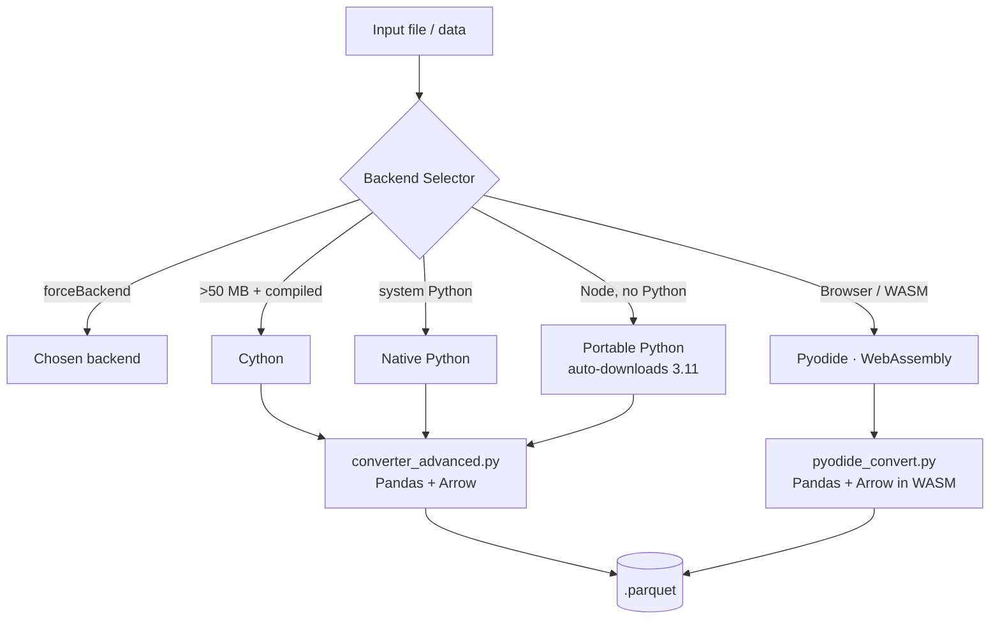

<div align="center">

# 🚀 Ultra Parquet Converter

### Professional hybrid **CSV / JSON / Excel → Parquet** converter for Node.js & the browser

Native speed when Python is available, **zero‑install WebAssembly** when it isn't.

[](https://www.npmjs.com/package/ultra-parquet-converter)
[](https://www.npmjs.com/package/ultra-parquet-converter)
[](https://opensource.org/licenses/Apache-2.0)
[](https://nodejs.org)
[](https://www.typescriptlang.org)
[](https://webassembly.org)

**[English](README.md)** · **[Español](README.es.md)** · **[Changelog](CHANGELOG.md)** · **[Architecture](docs/ARCHITECTURE.md)**

</div>

---

Ultra Parquet Converter combines the orchestration of **Node.js** with the data power of **Python + Apache Arrow** to turn 19+ tabular formats into compact, analytics‑ready **Parquet** — with streaming for massive files, automatic repair of corrupted data, and **four interchangeable backends** that require zero configuration.

```bash
npm install -g ultra-parquet-converter
ultra-parquet-converter convert sales.csv        # → sales.parquet, auto backend
```

---

## 🆕 What's new in 1.4.0

> A robustness & cleanup release. Highlights:

- 🌐 **WebAssembly path fixed end‑to‑end.** The Pyodide backend now works correctly through the automatic selector: `convert(path)` reads the file, runs the conversion in WASM and **writes the `.parquet` to disk**.
- 🧠 **New in‑memory API** `PyodideBackend.convertData(data)` for the browser and programmatic use (returns the Parquet bytes, no filesystem).
- 🔓 **`--backend pyodide` no longer requires system Python** — true zero‑install conversions from the CLI.
- ♻️ **Single source of truth** for the WASM conversion code (`python/pyodide_convert.py`), shared by Node and the browser worker — no more duplicated Python.

See the full [CHANGELOG](CHANGELOG.md).

---

## ✨ Features

| | |
|---|---|
| 🔍 **Smart auto‑detection** | Detects format by extension **and** by file content (magic bytes) |
| ⚡ **Ultra‑fast** | Apache Arrow + optimized Pandas under the hood |
| 🌊 **Streaming** | Convert 1 GB, 5 GB, 20 GB+ files without blowing up memory |
| 🔧 **Auto‑repair** | Fixes broken CSVs, drops empty columns, de‑duplicates |
| 📊 **Auto‑normalize** | Cleans column names, infers types automatically |
| 🧠 **Adaptive compression** | Picks snappy / zstd / lz4 / gzip / brotli for you |
| 🏗️ **4 backends** | Native · Portable · WebAssembly · Cython — auto‑selected |
| 🌐 **Runs in the browser** | Full WebAssembly path, no Python required |
| 🎨 **Polished CLI** | Colors, spinners, progress bars, batch & watch modes |
| 🧩 **Typed API** | First‑class TypeScript types for every option and result |

---

## 🏗️ Architecture



**Auto‑selection priority:** Cython (large files) → Native Python → Portable Python → Pyodide.

| Backend | Speed | Requires | Best for |
|---------|:-----:|----------|----------|
| **Cython** | 🚀🚀🚀🚀🚀 | Python 3.11 + compiled modules | Large files (> 50 MB) |
| **Native Python** | ⚡⚡⚡⚡⚡ | Python 3.11 | General purpose |
| **Portable Python** | ⚡⚡⚡⚡ | Node.js only (auto‑downloads Python) | No Python installed |
| **Pyodide** | ⚡⚡ | Nothing (WebAssembly) | Browser / zero‑install |

> **No Python?** No problem. **Portable Python** downloads Python 3.11 on first run (~30 MB on Windows, ~50 MB on Linux/macOS). **Pyodide** runs entirely in WebAssembly — even in the browser.

---

## 📋 Supported formats (19+)

| Category | Formats | Native / Portable / Cython | Pyodide (WASM) |
|----------|---------|:--------------------------:|:--------------:|
| **Delimited** | CSV, TSV, PSV, DSV (`.csv` `.tsv` `.psv` `.dsv` `.txt` `.log`) | ✅ | ✅ |
| **Spreadsheets** | Excel (`.xlsx` `.xls`) | ✅ | ✅ |
| **Structured** | JSON, NDJSON/JSONL (`.json` `.ndjson` `.jsonl`) | ✅ | ✅ |
| | XML, YAML, HTML (`.xml` `.yaml` `.yml` `.html`) | ✅ | — |
| **Big data** | Feather/Arrow, ORC, Avro (`.feather` `.arrow` `.orc` `.avro`) | ✅ | Parquet/Feather |
| **Databases** | SQLite (`.sqlite` `.db`) | ✅ | — |
| **Statistical** | SPSS, SAS, Stata (`.sav` `.sas7bdat` `.dta`) | ✅ | — |

> The WebAssembly backend covers the most common formats (CSV/TSV/PSV/JSON + Excel/Parquet). For the full format matrix, use a Python‑backed backend.

---

## 🔧 Installation

**Requirements:** Node.js ≥ 18. Python 3.11 is recommended for the Native/Cython backends (optional — the Portable and Pyodide backends need no Python).

```bash
# Global (recommended for CLI)
npm install -g ultra-parquet-converter

# Or as a project dependency
npm install ultra-parquet-converter
```

<details>
<summary><b>Optional: install Python 3.11 dependencies (for Native/Cython backends)</b></summary>

```bash
pip install pandas pyarrow numpy openpyxl lxml pyyaml fastavro pyreadstat
```

For offline / air‑gapped environments, install pre‑built wheels filtered by `cp311` and your OS (`win_amd64`, `linux_x86_64`, `macosx`):

```bash
pip install --no-index --find-links=./wheels \
  pandas pyarrow numpy openpyxl lxml pyyaml fastavro pyreadstat
```

Don't have Python at all? Skip this — `--backend portable-python` or `--backend pyodide` work without it.

</details>

---

## 🚀 Quick start

### CLI

```bash
# Simple conversion (auto backend)
ultra-parquet-converter convert data.csv

# With options
ultra-parquet-converter convert data.json -o out.parquet --streaming -v

# Zero‑install via WebAssembly (no system Python needed)
ultra-parquet-converter convert data.csv --backend pyodide

# Convert many files
ultra-parquet-converter batch "*.csv" -o converted/

ultra-parquet-converter --help
```

### Node.js / TypeScript API

```typescript
import { convertToParquet } from 'ultra-parquet-converter';

// Auto backend selection
const result = await convertToParquet('data.csv');
console.log(`${result.rows} rows → ${result.compression_ratio}% compression`);
console.log(`Backend: ${result.backend}`);

// Full options
await convertToParquet('huge_file.csv', {
  output: 'output.parquet',
  compression: 'zstd',          // snappy | zstd | lz4 | gzip | brotli | none | adaptive
  streaming: true,
  autoRepair: true,
  autoNormalize: true,
  parallelWorkers: 4,
  verbose: true,
  forceBackend: 'cython',       // force a specific backend
});
```

### Browser (WebAssembly, no Python)

```typescript
import { PyodideBackend } from 'ultra-parquet-converter';

const backend = new PyodideBackend();

// From a <textarea>, fetch(), or a File
const csv = 'id,name,city\n1,Juan,Lima\n2,Maria,Cusco';
const result = await backend.convertData(csv);

// result.parquet_bytes → number[]; turn it into a downloadable Blob
const blob = new Blob([new Uint8Array(result.parquet_bytes!)], {
  type: 'application/octet-stream',
});

// Binary input (Excel / Parquet) works too, via ArrayBuffer:
const file = document.querySelector('input[type=file]')!.files![0];
const excelResult = await backend.convertData(await file.arrayBuffer());
```

> A ready‑to‑run browser demo (Web Worker + progress UI) lives in [`web/`](web/): `index.html`, `pyodide-loader.js`, `worker.js`.

---

## 📚 CLI reference

Every command has a short alias.

### `convert <file>` &nbsp;·&nbsp; alias `c`

Convert a single file to Parquet.

| Option | Description |
|--------|-------------|
| `-o, --output <file>` | Custom output path |
| `-v, --verbose` | Detailed logs |
| `--streaming` | Streaming mode for large files |
| `--no-repair` | Disable auto‑repair |
| `--no-normalize` | Disable auto‑normalize |
| `--backend <type>` | Force backend: `native-python` · `portable-python` · `pyodide` · `cython` |
| `--compression <type>` | `adaptive` (default) · `snappy` · `zstd` · `lz4` · `gzip` · `brotli` · `none` |
| `--workers <n>` | Parallel workers (`0` = auto) |
| `--benchmark` | Show speed/throughput metrics |
| `--no-progress` | Disable the progress bar |

```bash
ultra-parquet-converter convert sales.csv
ultra-parquet-converter convert data.json -o analytics/data.parquet
ultra-parquet-converter convert huge_log.csv --streaming --compression zstd -v
ultra-parquet-converter convert data.csv --backend pyodide      # WASM, no Python
```

<details>
<summary>Sample output</summary>

```text
🔄 Ultra Parquet Converter v1.4.0

✔ Python installed (command: py)

📊 Results:

   Backend usado:      native-python
   Archivo origen:     sales.csv
   Archivo destino:    sales.parquet
   Tipo detectado:     CSV
   Filas:              125,430
   Columnas:           18
   Tamaño original:    25.4 MB
   Tamaño Parquet:     4.2 MB
   Compresión:         83.5%
   Algoritmo:          ZSTD (adaptativo)
   Tiempo:             2.34s
```

</details>

### `batch <pattern>` &nbsp;·&nbsp; alias `b`

Convert many files with a glob pattern.

| Option | Description |
|--------|-------------|
| `-o, --output-dir <dir>` | Output directory (default `./output`) |
| `-v, --verbose` | Verbose mode |
| `--streaming` | Streaming for all files |
| `--compression <type>` | Compression algorithm |
| `--workers <n>` | Parallel workers |

```bash
ultra-parquet-converter batch "*.csv"
ultra-parquet-converter batch "data/*.json" -o converted/
```

### `watch <directory>` &nbsp;·&nbsp; alias `w`

Watch a directory and convert new/modified files automatically (debounced).

| Option | Description |
|--------|-------------|
| `-o, --output-dir <dir>` | Output directory (default: same directory) |
| `-v, --verbose` | Verbose mode |
| `--streaming` | Enable streaming |
| `--compression <type>` | Compression algorithm |
| `--workers <n>` | Parallel workers |
| `--debounce <ms>` | Wait before converting (default `500`) |

```bash
ultra-parquet-converter watch ./incoming/ -o ./processed/ --streaming
```

### `backends`

List all backends and whether they're available in the current environment.

### `info <file>` &nbsp;·&nbsp; alias `i`

Show file metadata (name, path, extension, size, modified date) without converting.

---

## 💻 JavaScript / TypeScript API

### `convertToParquet(inputFile, options?)`

```typescript
interface ConversionOptions {
  output?: string;
  compression?: 'snappy' | 'zstd' | 'lz4' | 'gzip' | 'brotli' | 'none' | 'adaptive';
  streaming?: boolean;
  autoRepair?: boolean;
  autoNormalize?: boolean;
  parallelWorkers?: number;
  verbose?: boolean;
  forceBackend?: 'native-python' | 'portable-python' | 'pyodide' | 'cython';
  fileSize?: number;
}
```

Returns a `ConversionResult`:

```typescript
interface ConversionResult {
  success: boolean;
  backend: string;
  input_file?: string;
  output_file?: string;
  rows: number;
  columns: number;
  input_size: number;          // bytes
  output_size: number;         // bytes
  compression_ratio: number;   // percentage
  compression_used?: string;
  elapsed_time: number;        // seconds
  streaming_mode?: boolean;
  parallel_workers?: number;
  errors_fixed?: number;
  columns_removed?: number;
  chunks_processed?: number;
  limitations?: string[];      // Pyodide only
  parquet_bytes?: number[];    // in‑memory (convertData) only
}
```

### `PyodideBackend` — WebAssembly

```typescript
import { PyodideBackend } from 'ultra-parquet-converter';

const backend = new PyodideBackend(/* optional: { loader, logger, indexURL, sourceLoader } */);

// Browser / in‑memory → returns parquet_bytes
await backend.convertData(csvString | arrayBuffer, options?);

// Node → reads the file and writes the .parquet to disk
await backend.convert('data.csv', { output: 'data.parquet' });

// Check availability (WebAssembly present + Pyodide loadable)
await PyodideBackend.isAvailable();
```

### Manual backend control

```typescript
import { backendSelector, setBackend, getCurrentBackend, getAvailableBackends } from 'ultra-parquet-converter';

setBackend('cython');
console.log(getCurrentBackend());          // 'cython'
const info = await getAvailableBackends(); // availability + descriptions per backend
```

### Other exports

```typescript
import {
  convertToParquet,
  getAvailableBackends,
  setBackend,
  getCurrentBackend,
  checkPythonSetup,
  detectEnvironment,
  clearEnvironmentCache,
  backendSelector,
  NativePythonBackend,
  PortablePythonBackend,
  PyodideBackend,
  CythonBackend,
} from 'ultra-parquet-converter';
```

---

## 🧪 Development

```bash
npm install
npm run build          # compile TypeScript → dist/
npm test               # run the test suite
npm run test:coverage  # tests + coverage report
npm run lint           # type-check (tsc --noEmit)
```

Integration tests that need a real Python + pandas install are **skipped automatically** when those dependencies aren't present, so the suite stays green in any CI.

Project layout:

```text
src/
  backends/     native-python · portable-python · pyodide · cython · selector
  utils/        detect · download · progress · python-runner
  types/        shared TypeScript types
python/         converter_advanced.py (native) · pyodide_convert.py (WASM)
web/            browser demo (Pyodide worker + UI)
cython/         .pyx sources + compiled modules
```

---

## 🤝 Contributing

Issues and PRs are welcome at the [GitHub repository](https://github.com/Brashkie/ultra-parquet-converter). Please run `npm run build && npm test` before submitting.

## 📄 License

[Apache‑2.0](LICENSE) © **Hepein Oficial × Brashkie**
